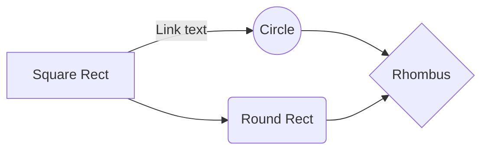
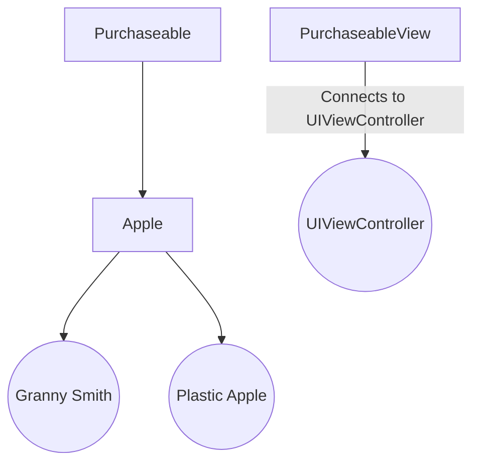

# Protocols

Protocols are a very powerful part of the Swift language when used to their full potential. Ultimately it allows developers to adhere to the Single Responsibility Principle in a very clean, modularized manner. In this tutorial we're going to turn you into a protocol-ninja and introduce the true power protocols possess.


# Story

Every good development team sprint starts with a story, and ours begins no differently. Let's set the scene for what we're setting out to do and paint the picture of our project.

Our project manager has informed us that we need to make an application where users can browse items, some allow the end-user to purchase them and some may not. If an item is able to be purchased then support needs to be added to allow that item to be added to the users shopping cart. To take it a step further, *(typical project managers)*, some items can also have a discount applied to them to reduce their price.

Okay – so this may seem like a lot but I promise you it's not. Protocols are going to rescue us from what might sound like a nightmare.

# Planning





# QA Testing

Phew... so far we've not only handled a barrage of requirements from our project manager but we have now also used protocols to meet the requirements. At least, we think. Now it's time for us to hand it off to our QA team to ensure our code is bug-free and works as expected.

While we're waiting on a Jira ticket to be created in our name though, let's be enthusiastically proactive developers that we are and write some unit tests to confirm our code is acting as we'd expect. Testing protocols is actually quite simple.

Let's write our tests starting with creating 100% test coverage on our `Purchaseable` protocol. In Xcode's left hand navigator pane open up your projects Test folder and create a new file, select `Unit Test Case Class` as the template type and name your file `PurchaseableTests.swift`.

TLDR; [PurchaseableTests.swift](https://github.com/Brayden/Snackable-Swift/blob/master/1.%20Protocols/ProtocolExamplesTests/Protocols/PurchaseableTests.swift)

In order for us to be able to test our protocol we need to create a mock object that adheres to it. Above our class declaration of our new file let's go ahead and create this mock class.

```
struct MockPurchaseable: Purchaseable {
    var displayName: String?
    var price: Double?
    var allowsDiscounts: Bool?

    init(displayName: String, price: Double) {
        self.displayName = displayName
        self.price = price
    }

    mutating func setupPurchaseable() { }
}
```

Why a mock class? This is only meant to be a placeholder within our test file so we can create an object that adheres to our `Purchaseable` protocol for us to test and verify the functionality works as expected.

The variables we define are simply from `Purchaseable` along with the `init` and `setupPurchaseable()` functions. Unfortunately we cannot test a protocol by itself which is why we're creating this mock class in the first place. This allows us to run our tests against a valid class that adopts the protocol functions for us to run our tests against. Woo.

There are 3 scenarios we want to test.

 1. Initialization
 2. Adding an item to the cart
 3. Applying a discount

Within our `PurchaseableTests` class now we'll create these three shell functions that we will fill in together, like so:

```
func testInitialization() {

}

func testAddToCart() {

}

func testShouldApplyDiscount() {

}
```

For those who may be less familiar with writing unit tests, all your functions should be prefixed with `test` in the name for the compiler to automatically pick up on running them when you press CMD + U.

Throughout these three functions we can reuse a single `MockPurchaseable` item so let's declare a single variable above our `setUp()` function. We are declaring it as a variable because as you see later there will be some mutating to the object.

```
var mockItem = MockPurchaseable(displayName: "Test Item", price: 9.99)
```

Testing initialization.. here we go. When we test an object for being initialized we want to know that it is not `nil`, actually having a reference value, and that the properties within it are what we expect – also not `nil` in this example. This is what our first function looks like:

```
func testInitialization() {
	XCTAssertNotNil(mockItem)
	XCTAssertEqual(mockItem.displayName, "Test Item")
	XCTAssertEqual(mockItem.price, 9.99)
}
```

Just as we had described in our action plan above, we check that it's not `nil`, it's property `displayName` is what we expect it to be (aka what we assigned in our class level variable), and same with price. Easy, right?

Two tests to go. Let's create a test for our `addToCart()` function. In this example we did not go into fully implementing the default function in our protocol because every application will handle adding to cart differently, whether it's making a network request, adding to a singleton to submit at a later time, or any number of possibilities. The one piece we did, however, put into the function was to simply return true to fulfill its return responsibility. No matter when we add something to the cart it says `true` and we know it's complete. 

```
func  testAddToCart() {
    XCTAssert(mockItem.addToCart())
}
```

> Note: Once you add your custom implementation logic your test will
> most certainly be different and should test adding items that are both
> in and out of stock.

And now for our final test, applying a discount. If you recall from our earlier implementation only one of our two Apple structs support discounts so we need to write a test that assures that both cases are tested and covered. Here's what we end up with:

```
func testShouldApplyDiscount() {
    mockItem.allowsDiscounts = false
    XCTAssertEqual(mockItem.shouldApplyDiscount(amount: 1.00), false)

    mockItem.allowsDiscounts = true
    XCTAssertEqual(mockItem.shouldApplyDiscount(amount: 1.00), true)
}
```

First we turn our `mockItem` property for `allowsDiscounts` to false. Try to apply a discount to it and we expect false – allowing the first two lines of our test to pass.
The second two lines are doing the opposite, saying we allow discounts and when we call the function we expect it to pass. Ta-da!

Now we won't cover implementing tests in all of the classes we created in this project but if you are curious you can look at the project in Github and see that all of the classes we created have 100% test coverage in that project. Feel free to dig in and check out how we got there!
